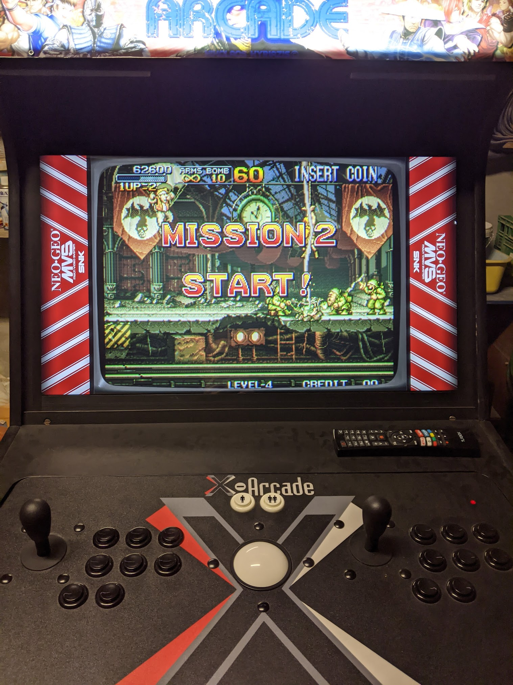

# My very own CRT Arcade Cabinet

## Preface

I grew up in the era when home entertainment started overtaking the world but the Arcades were still relevant and very active. Having spent countless hours in the arcades, mostly at the store near my grandpadent's resort, I have been wanting to be able to have them in my home, as you do, with the same intensity. Now I'm old enough that I can do somethign about it myself :) .

I have built other cabinets, for myself and friends, but they were based on LCD displays. I'm most happy with the very 1st cabinet I built, which featured an embedded system powerful enough to employ my favorite CRT shader, [newpixie-CRT](https://github.com/libretro/slang-shaders/blob/master/crt/newpixie-crt.slangp). I can hardly tell it apart the experience I get from a real CRT, but the geometry along is enough to break immersion. Still, I love it to the degree that I almost have whatever isn't like it :) .

## Summary

There are a few games that come immediately to my mind when the word arcade is invoked. The very first is NBA JAM! Others are Mortal Kombat, Metal Slug, etc. From all the arcade builds that I can actually try to make myself (e.g. I'm not considering plastic or metal cabinets) I really liked the Midway cabinets, with NBA JAM being the go-to reference. So, I would build an arcade cabinet that resembled (up to certain degree) the NBA JAM arcade cabinet.

The very basic ingredients are:
- Equipment to run the emulation on
- A CRT that is large enough
- Joysticks that preserve the look and feel of the original
- Some plans that put everything together
- Actually, putting everything together

## Emulation equipment

Starting from the design requirement of being able to display on a CRT, I went for the [Raspberry Pi](https://www.raspberrypi.com/products/raspberry-pi-3-model-b/) 3 to pair with [Pi2Scart](http://pi2jamma.info/pi2scart). The latter dictated the selection on the former, as no other combination is reported to work as well with no significant effort. I wasn't worried the horsepower might not be enough, because, the design choice to go for the oldies keeps everything within boundaries, including computational ones. The only exception I've run into so far is the other game I love, [Run and Gun 2](https://en.wikipedia.org/wiki/Run_and_Gun_II), which takes some powerful hardware to emulate nicely (not even rpi4 can handle it smoothly).

Apart from the H/W, it also takes the right kind of software to make ends meet. I've settled for the [Retropie CRT Edition](https://github.com/krahsdevil/Retropie-CRT-Edition) project, which, in my short experience, is the most well-behaved and predictable set-up. It's retropie with some hooks and python magic on top to automatically handle a) databasing CRT display requirements of games b) enforcing them in a dynamic fashion, so that no hard choices need to be made across.