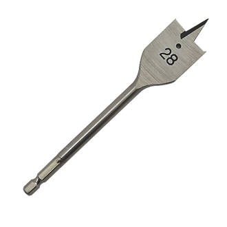
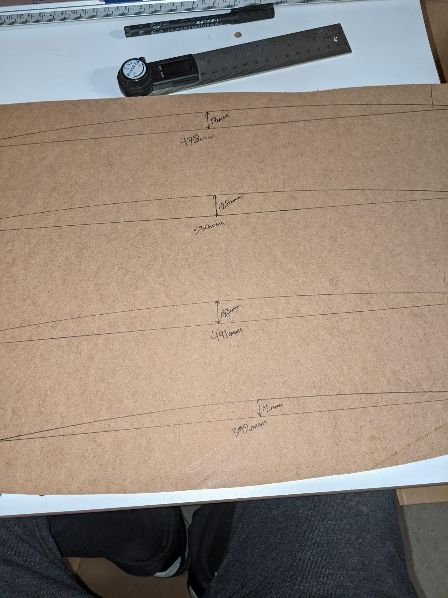

# My very own CRT Arcade Cabinet

## Preface

I grew up in the era when home entertainment started overtaking the world but the Arcades were still relevant and very active. Having spent countless hours in the arcades, mostly at the store near my grandpadent's resort, I have been wanting to be able to have them in my home, as you do, with the same intensity. Now I'm old enough that I can do somethign about it myself :) .

I have built other cabinets, for myself and friends, but they were based on LCD displays. I'm most happy with the very 1st cabinet I built, which featured an embedded system powerful enough to employ my favorite CRT shader, [newpixie-CRT](https://github.com/libretro/slang-shaders/blob/master/crt/newpixie-crt.slangp). I can hardly tell it apart the experience I get from a real CRT, but the geometry along is enough to break immersion. Still, I love it to the degree that I almost have whatever isn't like it :) .

## Summary

There are a few games that come immediately to my mind when the word arcade is invoked. The very first is NBA JAM! Others are Mortal Kombat, Metal Slug, etc. From all the arcade builds that I can actually try to make myself (e.g. I'm not considering plastic or metal cabinets) I really liked the Midway cabinets, with NBA JAM being the go-to reference. So, I would build an arcade cabinet that resembled (up to certain degree) the NBA JAM arcade cabinet.

The very basic ingredients are:
- Equipment to run the emulation on
- A CRT that is large enough
- Joysticks that preserve the look and feel of the original
- Some plans that put everything together
- Actually, putting everything together

## Emulation equipment

Starting from the design requirement of being able to display on a CRT, I went for the [Raspberry Pi](https://www.raspberrypi.com/products/raspberry-pi-3-model-b/) 3 to pair with [Pi2Scart](http://pi2jamma.info/pi2scart). The latter dictated the selection on the former, as no other combination is reported to work as well with no significant effort. I wasn't worried the horsepower might not be enough, because, the design choice to go for the oldies keeps everything within boundaries, including computational ones. The only exception I've run into so far is the other game I love, [Run and Gun 2](https://en.wikipedia.org/wiki/Run_and_Gun_II), which takes some powerful hardware to emulate nicely (not even rpi4 can handle it smoothly).

Apart from the H/W, it also takes the right kind of software to make ends meet. I've settled for the [Retropie CRT Edition](https://github.com/krahsdevil/Retropie-CRT-Edition) project, which, in my short experience, is the most well-behaved and predictable set-up. It's retropie with some hooks and python magic on top to automatically handle a) databasing CRT display requirements of games b) enforcing them in a dynamic fashion, so that no hard choices need to be made across.

## The CRT

It's been a while since I started this campaign to find the right CRT. Despite the abundance of CRTs, as they constituted the state of the art, not so many decades ago, there are several issues or requirements that have made this task a difficult one:
- **People have forgotten about them:** I've spent so much time searching for them that I was almost infuriated whenever some friend of acquaintance came to me with "why didn't you tell me earlier/I'd forgotten that ... I have one lying around".
- **The TV needs to be large:** The original NBA JAM cabinet featured a 25" CRT monitor. When you're that close to the monitor, this size is OK, so, this constituted the low threshold in my search. It turns out not so many people have large CRTs to spare. A lot of them have 21" or less.
- **The TV needs to be in a good shape:** There are conflicting requirements. I was looking for something old that is in good shape. Good shape means that it can be successfully driven by my rpi3 (I was using the CRT tools in the image to test each time I considered a CRT candidate), it is lively enough to show that there are at least 5 good years in its parts (the capacitors, which are the main culprit, and the emitter, which if dead requires the questionable supercharge boost), its display geometry isn't awful (CRTs are notorious for having imperfect display) and there is the ability to fine tune the geometry through some kind of service mode.
- **The tube needs to be curved:** Latest tech in CRTs led to flat screens, which is a great technological feat given the conic nature of the projection, but has nothing to do with my experience with the oldies and the obviously curved monitors.

This process has led to final selection, but, also, to several CRTs lying around in my basement. The one that made the cut was the Thomson 28DG17E. It is a 28" TV, with stereo speakers that are thin enough to not requiring to rip the chasis apart in order to fit to the cabinet, is lively and curvy (not as curvy as I would have liked, but curvy still), and has a service menu for the geometry (to which I still have no access to this day because I lack the remote control).

## Joysticks

So far I've had the two extremes in the spectrum of joystick H/W. On the one hand I have the [Tankstick](https://shop.xgaming.com/products/x-arcade-tankstick-trackball-usb-included), which is awesome (sturdy, clicky and comfortable). I won't elaborate on the other extreme. I was looking for something that looked like the original selection by Midway and run into the [IL series](https://www.smallcab.net/bat-top-c-30_91_226_302.html) which I bought from [smallcab](http://smallcab.net/). The arcade was going to be a 4 seater, so I needed 4 sets. I got all colors and matching buttons. Interestingly, the manufacturer (IL) pitches the H/W as being a Midway rip-off but better made. I don't know whether it's better made (too long ago to remember), but, the quality is top! And, they are visually indiscernible to the originals.

## The plans

The baseline was some Midway adoptions I found online.

From these plans, I tried to preserve the angles and fine tune all the rest to fit the equipment I was going to put in. After hours of toying around in Fusion 360, I ended up to the following model.

You might see that everything is planned out, except for the front that covers the TV and the back. More on that next. The TV would be supported by a frame that had the right angle and a block to stop the TV from sliding. The TV appears floating, but this is only concept art. The angle brackets displayed are actually the ones I used for the assembly, but, perhaps on the exact locations shown. The whole cabinet would be on top of some rollers, to facilitate moving it. This is a lesson I learned the hard way.

## Putting it all together

### Wood parts

The whole cabinet would fit in a 1850mm x 3300mm sheet of particle board with black melamine coating. Most of the cabinetry is straight cuts, so, most of the parts where cut out during the order of the sheet. The tricky parts were the sides, i.e. the two tall parts and the angled sides of the control panel. For these parts I employed the services of a local CNC routing shop.

### Joinery

I used steel 45mm angle brackets to mount the melamines together. They were merely to hold the thing together. They do not suffice to make the build sturdy. But that would come along with the wooden frame. For the wooden frame the parts were cut to length and correct angles and were joined with wood glue and long screws. Then, the frame and the melamines where attached to each other with some more steel angle brackets.

### The control panel

Originally, I thought the hardest problem would be to accurately pick the drilling points for the button and joystick holes. This turned out to be the easiest part :) . I took the design from Fusion 360, exported it to .dxf, loaded it in [QCAD](https://qcad.org/en/) and printed it across several A4 pages with join marks. I then put everything together on top of the control panel to mark the drilling points.

To open the holes I got a 28mm (to match the button diameter) flat drilling bit. In retrospect, I should have gotten a forstner bit instead :( .

This bit did not bode well with the particle nature of the wood and the amateurism of yours truly. As a result, most holes where OK, but, there was severe damaging of the control panel with chunks being ripped apart. Also, due to the imperfect angle induced by freeform drilling the holes were more elliptic than circular. This was hard to pick with the naked eye and was only revealed when trying to fit the buttons in. I had to do some serious repairing and overpaint to bring the whole thing in a presentable state once again. Repainting went directly against the design choice of relying on the acrylic finish.

Apart from the hole issues, there was some t-mold slot cutting and sanding that went well :) .

I will be redoing the control panel carpentry, so, more on that to come.

On the electronics side, I installed all the parts and the wiring. I also installed three hinges to allow for the control panel to be opened in a well structured fashion. I feared I needed some kind of lock so that the door would not open accidentally, but I was glad to realize that it would be an overkill, as the weight of the door itself and the pressure being applied during gaming would never allow it. The only requirement is that the hinges are sturdy so that there is no planar motion.

 

### Speakers

I already knew which spearers I was going to use. I had a spare Creative T5400 lying around. I had already used another one in my first arcade (2.1 mode) and I was super happy, so, same recipe

What did change since then was that I ramped up on the 3D modelling skils and I also got a 3D printer in the meantime. So, given some very nice 3D model of the speakers, I designed routing templates and holders for the speakers. The nice thing with these speakers is that the cloth in front is mounted through 4 insert slots to the main body and can come apart. So I designed to actually bring the speaker surface between them and install in the cabinbet. Some 3D printing and routing later I ended up with the following result, of which I am super happy.

I would then drill holes, with a new template, to install the cloth piece.

### Pre-integration

With every part in place so far, I was able to check the whole thing out.

### Monitor bezel

The CRT should not just hang there in the void. There is supposed to be a bezel that makes the TV appear as integrated with the rest. I left this step for after the pre-integration, because it is the most error prone, as it heavily depends on the pre-integration state and deviation from any planning. E.g. I did not plan *exactly* where the CRT would end up, because I have no accurate 3D model of it.

The process I followed to create the bezel is based on the following assumptions:
- The tube is perpendicular to the support surface
- The tube is a section of a sphere, i.e. there is a single radius that describes all curvatures

The assumptions imply that if I got the geometry right I could apply a symmetric bezel that would stay parallel with the lines of the cabinet.

To measure the tube I employed a special jig which I had bought exactly for that purpose and which I should have bought so many years already.

The principle of the jig is that you push it against some profile you want to copy and then you get it on the back side. This is what I did with the TV. I pushed it several times and at several angles against the tube, got the profiles back, put them on paper, measure them and then try to estimate the average radius all the curves corresponded to. I also tape measured the borders of the crt, to figure out the section angles.

I then went back to Fusion 360, set-up a sphere for the average angle, applied the section measurements and got a proxy of the tube geometry. Since I had decided I would make the bezel from 4mm mdf, I extruded the edges of the proxy by a certain amount to get the bezel geometry. I converted it to a 4mm shell (cut hollow) and then split into parts I could cut.

I would cut the parts and glue them together, so, I also 3D printed a jig to hold them in place (the white part in the image).

The initial effort was to print templates and jigsaw them. However, my jigsaw-fu was not strong enough to generate a perfect bezel. I still got close enough.

So, I resorted to laser cutting and re-iterated.

